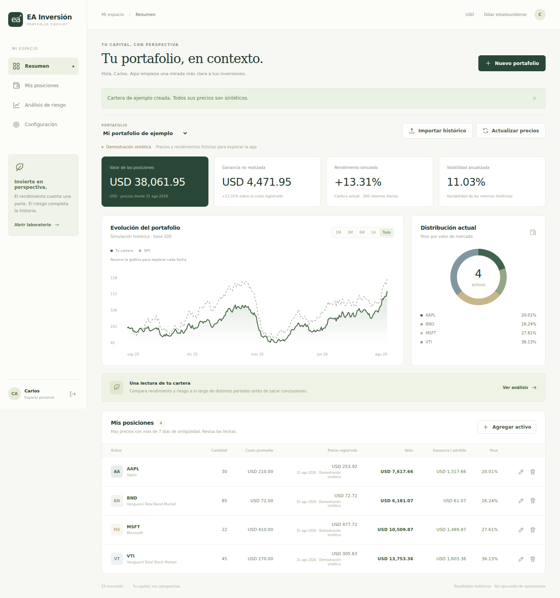
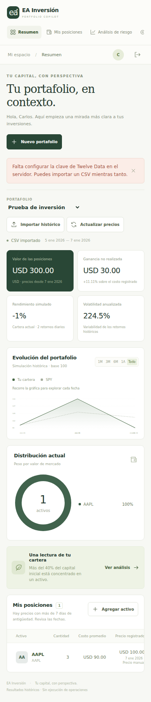

# Portfolio Copilot

Interactive portfolio analytics platform for exploring portfolio value, allocation, historical performance, risk and benchmark-relative behavior.

Built by Carlos Pérez as a finance and software development portfolio project. The application combines a Next.js dashboard with a FastAPI service and an independent financial analytics engine.

## Project Status

Existing MVP migrated from `project-invest/ea-inversion/` into this repository's root. Source implementation, dependencies, automated tests and screenshots are preserved. Frontend and test directories have been normalized; path-dependent scripts and CI have been updated. See [migration](docs/migration.md) and [validation](docs/validation.md) for evidence and limits.

| Capability | Current scope |
| --- | --- |
| Portfolio value and allocation | Holdings, quantities, average costs, recorded market prices and weights |
| Historical return | Buy-and-hold simulation of current positions; normalized portfolio and benchmark curves |
| Volatility and Sharpe ratio | Annualized daily historical metrics; configurable annual risk-free rate |
| Beta and maximum drawdown | Benchmark-relative sensitivity and peak-to-trough loss |
| Benchmark comparison | SPY by default or another supported USD benchmark |
| CSV import and export | Historical prices imported; current positions exported |
| Authentication and persistence | Argon2id passwords, revocable sessions, account ownership checks and SQLAlchemy |
| Market data integration | Twelve Data adapter and cache; live provider access needs a server-side user key |
| Expected return | Planned forward-looking extension; historical return is not an expected-return forecast |

## Screenshots

Existing desktop and mobile screenshots use synthetic data and a disposable test account. They document the earlier MVP interface and retain its EA Inversión branding.



<details>
<summary>Mobile screenshot</summary>



</details>

## Tech Stack

Python 3.12 · FastAPI · SQLAlchemy · SQLite · PostgreSQL-compatible configuration with psycopg · Next.js · React · TypeScript · pytest · Playwright · GitHub Actions · Twelve Data.

## Repository Structure

| Path | Purpose |
| --- | --- |
| `frontend/` | Next.js dashboard, CSV laboratory and same-origin API proxy |
| `backend/app/` | Authentication, persistence, market data and portfolio analytics |
| `tests/backend/` | Existing financial-engine, API, ownership and provider tests |
| `scripts/` | Local launcher and Playwright browser smoke test |
| `docs/` | Methodology, migration, validation and preserved source material |
| `.github/workflows/ci.yml` | Backend tests, TypeScript checks, build and browser checks |

## Run Locally

Use Python 3.12 and Node.js 22.17 or later. From the repository root:

```sh
python scripts/dev.py --setup
python scripts/dev.py
```

Open `http://localhost:3000`, create a local account and explore the clearly labeled synthetic demo, or create an empty portfolio. Ctrl+C stops both servers. SQLite data defaults to `data/ea-inversion.db`; the filename is retained for compatibility. Use the same `localhost` origin for browser access.

For optional configuration, copy `.env.example` to `.env`. Keep `TWELVE_DATA_API_KEY` blank for demo/CSV use, or supply your own key on the server. The launcher reads this file without shell execution and excludes database and provider credentials from the frontend process. PostgreSQL may be configured with `DATABASE_URL`; actual PostgreSQL integration validation remains pending.

## Tests and CI

After installing the dependencies:

```sh
.venv/bin/python -m pytest -q
npm --prefix frontend run typecheck
npm --prefix frontend run build
cd frontend
npx playwright install chromium
npm run test:e2e
```

On Windows use `.venv\Scripts\python.exe`. The browser test starts its own servers, disposable account and temporary SQLite database; it writes screenshots to ignored `test-results/`. GitHub Actions runs the same checks. A workflow configuration is not proof that a run has passed; recorded results belong in [validation.md](docs/validation.md).

## Methodology

Recorded quantity × unadjusted price determines market value; quantity × average cost determines cost basis. Missing position prices leave the total and weights undefined. Historical analytics simulate current positions from the beginning of the selected interval, using adjusted daily prices, initial weights and fixed units without rebalancing or cash flows. Portfolio and benchmark curves start at 100.

Volatility and Sharpe use sample daily return dispersion and 252 sessions per year. Sharpe converts the configured annual risk-free rate to a daily rate. Beta uses daily portfolio/benchmark covariance divided by benchmark variance. Maximum drawdown includes the initial capital level. Undefined Sharpe or beta is returned as null. See [methodology](docs/methodology.md) for formulas and CSV requirements.

## Limitations

- Historical results are descriptive; the app does not estimate expected return or guarantee future performance.
- The simulation does not reconstruct actual trades, contributions, withdrawals, transaction costs, taxes or a transaction ledger.
- USD only; CSV corporate adjustments and calendars are declared by the uploader and not independently verified.
- Twelve Data is implemented, but a real provider account, quota and entitlement check is still required. A failed refresh preserves existing data and never substitutes synthetic prices.
- PostgreSQL compatibility is configured but has not been checked against a real PostgreSQL server here.
- Local authentication is implemented; production deployment still requires HTTPS, secure cookies, backups, versioned migrations, account recovery and production traffic controls.
- No order execution, generative AI, advanced optimizer or performance claims are included in this MVP.

## Related Projects

[Apple Equity Research](https://github.com/8z97y6wgr2-sys/apple-equity-research) · [Financial Analysis Lab](https://github.com/8z97y6wgr2-sys/financial-analysis-lab)
